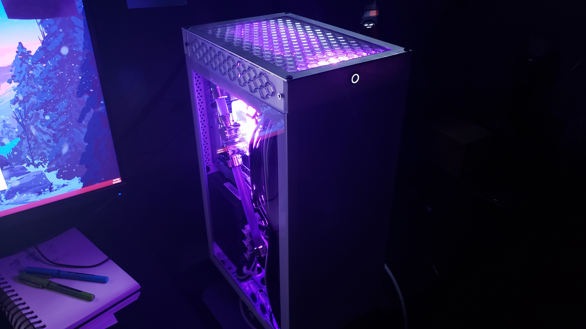

# Meshy Tophat & Radiator Mount
Here be files for my Meshlicious tophat design, as well as a 240/280mm rad mount! Keep in mind that your mileage may vary significantly, and I'm sure this could be done better.

The tophat is only compatible with the **EK 3080 Founders Edition waterblock**, but if this gets popular enough (or if you feel so inclined to do so yourself) then more general support may appear in the future.

## Credits!
Big thanks to this Thingiverse file for giving me an idea of initial mounting holes: https://www.thingiverse.com/thing:4875405
- Creative Common license for the above: https://creativecommons.org/licenses/by/4.0/

## Programs Used
- Affinity Designer - For adding patterns to the FreeCAD base files.
- FreeCAD - For the radiator mount & acrylic panels.
- TinkerCAD - For modeling the tophat pieces (.stl files).

## You'll Need...
1. Pretty much everything is designed for **#6-32 screws**. Grab a **variety pack**, I'm too lazy to give you specific lengths lol.
2. You'll also need a **#6-32 tap** for threading holes in the print and rad mount.
3. A **drill** and a bit for #6-32 holes.
4. Might need a **dremel** for removing parts of the case to help with wacky bends, but this is not necessary.
5. Consider finding yourself **long PCIE riser cable**. The LinkUP dual reverse cables on Amazon (27cm) are too short, so I'd suggest trying to find a longer cable. I daisy chained some existing PCIE risers. 

# Parts Overview
1. Tophat - For housing the GPU, made up of two 3D printed parts that get screwed directly into the case.
2. Tophat Panels - For enclosing the tophat. 
3. Radiator Mount - For attaching a radiator to the side of the case.

## Tophat Notes
- Drill out the two holes in each piece (four total) that connect the pieces to the case itself.
- You'll also need to remove some of the screws from the case (two on each side).
- I'd strongly recommend printing the back piece at **100% infill**, and the front at **20% infill** at least.
- That GPU, screwed into the back piece, is rock solid. 

## Tophat Panel Notes
- I found that **3mm acrylic** from Ponoko worked pretty well for these pieces.

## Radiator Mount Notes
- Included is a **280mm mount** and a set of adapters for **240mm** rads. 
- I ordered my pieces in **2mm aluminum** which felt kiiinda flimsy, but with the radiator screwed in it seemed fine. I'd suggest going with steel, or perhaps a thicker aluminum.
- The stabilizer should be printed at **100% infill** and can be placed on the bottom of the case right up against the unsecured corner of the mount. I'd screw in from the bottom of the case into the piece directly. 
- You should be able to adjust placement of the radiator to your heart's content. I preferred placing my rad closer to the top to open space below for my pump and reservoir. 

**Rad compatability will vary**, but I can confirm that these pieces worked for **Corsair XR5 280mm** and **Nemesis GTS 240mm** radiators. 
